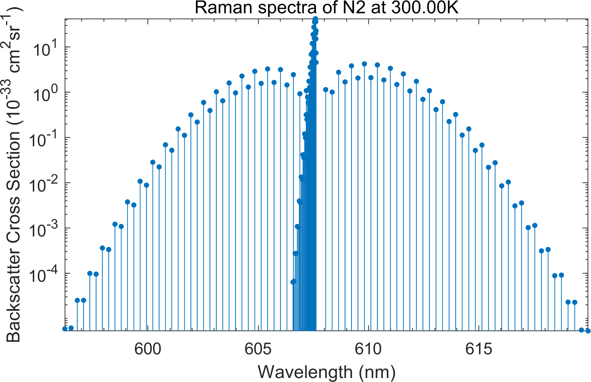

# Lidar Molecule Scattering Simulation (LiMSS)工具箱

<p align='center'>

<br>
<b>氮分子振转拉曼谱</b>

LiMSS工具箱提供针对大气激光雷达的分子散射特性仿真，包括分子瑞利散射、转动拉曼散射、振动拉曼散射、分子偏振信号和水分子拉曼散射信号的仿真计算。利用LiMSS工具箱可以计算在不同环境条件下的大气分子散射特性，为大气激光雷达信号仿真和功能仿真提供支撑。

## 下载

点击右上角下载按钮即可下载代码压缩包。

如果使用`git`，可以利用以下指令进行下载：

```bash
git clone https://github.com/ZPYin/LiMSS.git
```

## 运行

> 本工具箱基于Matlab (2017b)版本开发，对于老版本Matlab中运行本工具箱出现的错误，不属于运行维护的范畴，请使用者注意！！！

打开**Matlab**，将工具箱目录加载到**Matlab**搜索路径中，或者通过运行工具箱中的`setupLiMSSToolbox`进行加载。

## 运行样例

参考[tests](./tests/)文件夹下的代码，运行特定样例，了解工具箱的主要功能和使用方法。

- test_delta_m: 仿真分子偏振散射截面
- test_Rayleigh_Scattering: 仿真分子瑞利散射截面
- test_rotational_Raman: 仿真分子转动拉曼散射截面
- test_tentiS6: 仿真分子瑞丽布里渊谱
- test_vibrational_Raman: 仿真分子振转拉曼散射截面
- test_WV_Raman: 仿真水汽分子拉曼散射截面

## bug异常反馈

有运行异常，请在[Issues](https://github.com/ZPYin/LiMSS/issues)中进行反馈。
反馈模板：

```txt
异常现象描述：

运行版本信息：

可能原因分析：

```


## 联系人

殷振平
zp.yin@whu.edu.cn